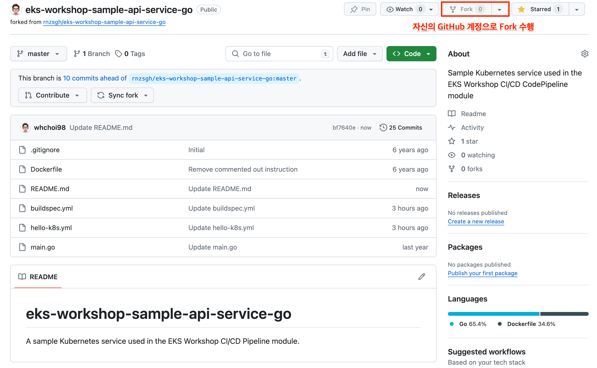

# 인증/자격증명 및 환경 구성

## 인증 및 자격증명 환경 구성

### 1.IAM 역할 생성

**IAM - 역할 - 역할 만들기**

IAM 서비스 대쉬보드 접속 및 역할\(Role\) 생성을 합니다. AWS 서비스에서 IAM을 선택하고, "역할 만들기"를 선택합니다.


### 2.역할\(Role\)을 만듭니다.

EC2 - 다음: 권한

역할 만들기 단계에서 EC2를 선택하고, "다음:권한"을 선택합니다.


권한정책 연결에서 "AdministartorAccess"를 선택합니다.


역할 이름 생성 및 정책 연결을 확인합니다.

역할 이름

```text
eksworkshop-admin
```


### 3.Cloud9 권한 설정.

Cloud9 상단 좌측 메뉴에서 EC2 대쉬보드로 접속을 선택하거나, AWS 서비스에서 EC2 대쉬보드로 접속합니다.


EC2 대쉬보드의 인스턴스에는 이미 생성된 Cloud9 EC2 인스턴스가 보입니다.

"작업"-"인스턴스 설정"-"IAM 역할 연결/바꾸기"를 선택합니다.


앞서 생성한 IAM 역할 **"eksworkshop-admin"**을 선택합니다.


정상적으로 Cloud9 IDE의 IAM 역할이 정상적으로 연결되었는지 확인합니다.


### 4. 기존자격 증명 파일 제거

Cloud9의 기존 자격증명과 임시 자격 증명등을 비활성화 합니다.

Cloud9에서 설정 환경을 아래와 같이 선택합니다.


Cloud9 설정환경에서 "AWS managed temporary credential"을 비활성합니다.


임시 자격증명이 설치되지 않도록 기존 자격 증명 파일을 제거합니다.

```text
rm -vf ${HOME}/.aws/credentials
```


Cloud9 생성에서 Network 설정을 하지 않았다면, Default VPC - Public Subnet에 Cloud 9 인스턴스는 배치됩니다.


5. Cloud9 IDE 역할 점검

Cloud9 이 올바른 IAM 역할을 사용하고 있는지 확인합니다.

```text
aws sts get-caller-identity --query Arn | grep eksworkshop-admin -q && echo "IAM role valid" || echo "IAM role NOT valid"
```

6. Shell 환경변수 저장

Account ID, Region 정보 등을 환경변수와 프로파일에 저장해 두고, EKSworkshop 에서 사용합니다.

```text
export ACCOUNT_ID=$(aws sts get-caller-identity --output text --query Account)
export AWS_REGION=$(curl -s 169.254.169.254/latest/dynamic/instance-identity/document | jq -r '.region')
test -n "$AWS_REGION" && echo AWS_REGION is "$AWS_REGION" || echo AWS_REGION is not set
```

bash\_profile에 저장합니다.

```text
echo "export ACCOUNT_ID=${ACCOUNT_ID}" | tee -a ~/.bash_profile
echo "export AWS_REGION=${AWS_REGION}" | tee -a ~/.bash_profile
aws configure set default.region ${AWS_REGION}
aws configure get default.region
```

출력결과 예제는 아래와 같습니다.

```text
export ACCOUNT_ID=xxxxxxxx
export AWS_REGION=ap-northeast-2
ap-northeast-2
```

## SSH 키 생성

eksworkshop에서 사용될 키를 생성합니다.

### 1.SSH Key 생성

Cloud9에서 ssh key를 생성합니다.

```text
ssh-keygen
```

아래는 예제입니다.key 이름을 eskworkshop으로 생성하였습니다.

```text
ssh-keygen
Generating public/private rsa key pair.
Enter file in which to save the key (/home/ec2-user/.ssh/id_rsa): eksworkshop
Enter passphrase (empty for no passphrase): 
Enter same passphrase again: 
Your identification has been saved in eksworkshop.
Your public key has been saved in eksworkshop.pub.
The key fingerprint is:
SHA256:zAcvK4NFMkIaB4Vh507xv6LsYX/GMhXdb50TBZQasYE ec2-user@ip-172-31-41-2
The key's randomart image is:
+---[RSA 2048]----+
|+*+o       .oooo |
|o=o o     E .o. .|
|. .oo.. o . .o  .|
|  o. +.+ + ..  . |
|   .  ..S o . . o|
|     o ..+   o + |
|   o..=..   .   .|
|  o +o.*         |
|  .+ .=          |
+----[SHA256]——+
```

### 2.ssh key 전송

생성된 SSH key를  Key 페어로 전송합니다. 앞서 eksworkshop.pub 로 public key가 생성되었습니다.

```text
aws ec2 import-key-pair --key-name "eksworkshop" --public-key-material file://~/environment/eksworkshop.pub
```

생성된 key를 "AWS 서비스" - "EC2 대시보드" 에서 확인합니다.


## CMK  생성

### KMS 소개

AWS KMS\(Key Management Service\)를 사용하면 손쉽게 암호화 키를 생성 및 관리하고 다양한 AWS 서비스와 애플리케이션에서의 사용을 제어할 수 있습니다. AWS KMS는 FIPS 140-2에 따라 검증되었거나 검증 과정에 있는 하드웨어 보안 모듈을 사용하여 키를 보호하는 안전하고 복원력 있는 서비스입니다. 또한, AWS KMS는 AWS CloudTrail과도 통합되어 모든 키 사용에 관한 로그를 제공함으로써 각종 규제 및 규정 준수 요구 사항을 충족할 수 있게 지원합니다. 



EKS에서는 K8s와 Key를 통한 인증이 많이 일어납니다. 안전한 관리를 위해 Option으로 구성할 수 있습니다.

### 1.CMK 생성

K8s Secret 암호화를 할 때, EKS 클러스터에서 사용할 CMK를 생성합니다.

```text
aws kms create-alias --alias-name alias/eksworkshop --target-key-id $(aws kms create-key --query KeyMetadata.Arn --output text)
```

### 2. CMK ARN 변수 저장

CMK의 ARN을 $MASTER\_ARN에 입력해 둡니다. 

```text
export MASTER_ARN=$(aws kms describe-key --key-id alias/eksworkshop --query KeyMetadata.Arn --output text)
```

MASTER\_ARN에 입력된 값을 조회해 봅니다.

```text
 echo $MASTER_ARN
```

출력 결과 예제 

```text
arn:aws:kms:ap-northeast-2:xxxxxxx:key/xxxxxxx
```

이 랩에서 KMS Key를 쉽게 참조 할 수 있도록 MASTER 환경변수를 bash\_profile에 저장합니다.

```text
echo "export MASTER_ARN=${MASTER_ARN}" | tee -a ~/.bash_profile
```

출력 결과 예제

```text
whchoi98:~/environment $ echo $MASTER_ARN
arn:aws:kms:ap-northeast-2:909121566064:key/9a0c5a6c-be81-4463-90e4-e3b1252d96fc
whchoi98:~/environment $ echo "export MASTER_ARN=${MASTER_ARN}" | tee -a ~/.bash_profile
export MASTER_ARN=arn:aws:kms:ap-northeast-2:909121566064:key/9a0c5a6c-be81-4463-90e4-e3b1252d96fc
```


